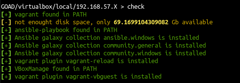
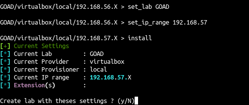

# :simple-virtualbox: Virtualbox

<div align="center">
  
  
  
</div>

## Prerequisites

- Providing
    - [Virtualbox](https://www.virtualbox.org/)
    - [Vagrant](https://developer.hashicorp.com/vagrant/docs)
    - Vagrant plugins:
        - vagrant-reload
        - vagrant-vbguest 
        - winrm
        - winrm-fs
        - winrm-elevated

- Provisioning
    - Python3 (version between [3.8, 3.11])
    - goad requirements
    - ansible-galaxy goad requirements


## Check dependencies

```bash
./goad.sh -p virtualbox
GOAD/virtualbox/local/192.168.56.X > check
```



!!! info
    If there is some missing dependencies goes to the [installation](../installation/index.md) chapter and follow the guide according to your os.

!!! note
    check give mandatory dependencies in red and non mandatory in yellow (but you should be compliant with them too depending one your operating system)

## Install

- To install run the goad script and launch install or use the goad script arguments

```bash
./goad.sh -p virtualbox
GOAD/virtualbox/local/192.168.56.X > set_lab <lab>  # here choose the lab you want (GOAD/GOAD-Light/NHA/SCCM)
GOAD/virtualbox/local/192.168.56.X > set_ip_range <ip_range>  # here choose the  ip range you want to use ex: 192.168.56
GOAD/virtualbox/local/192.168.56.X > install
```



- or all in command line with arguments

```bash
./goad.sh -t install -p virtualbox -l <lab> -ip <ip_range_to_use>
```