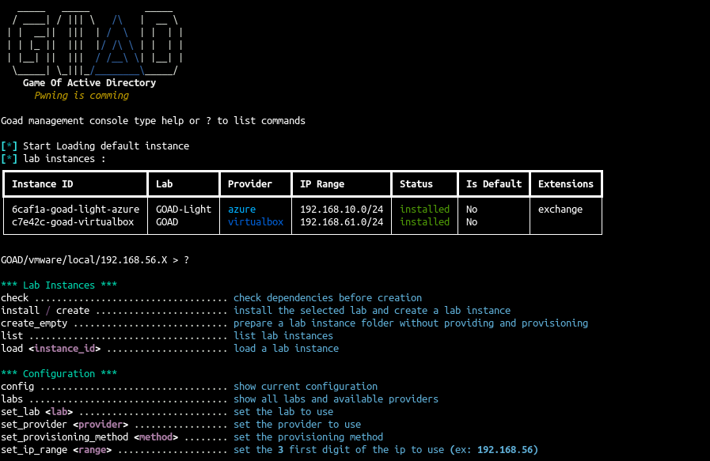
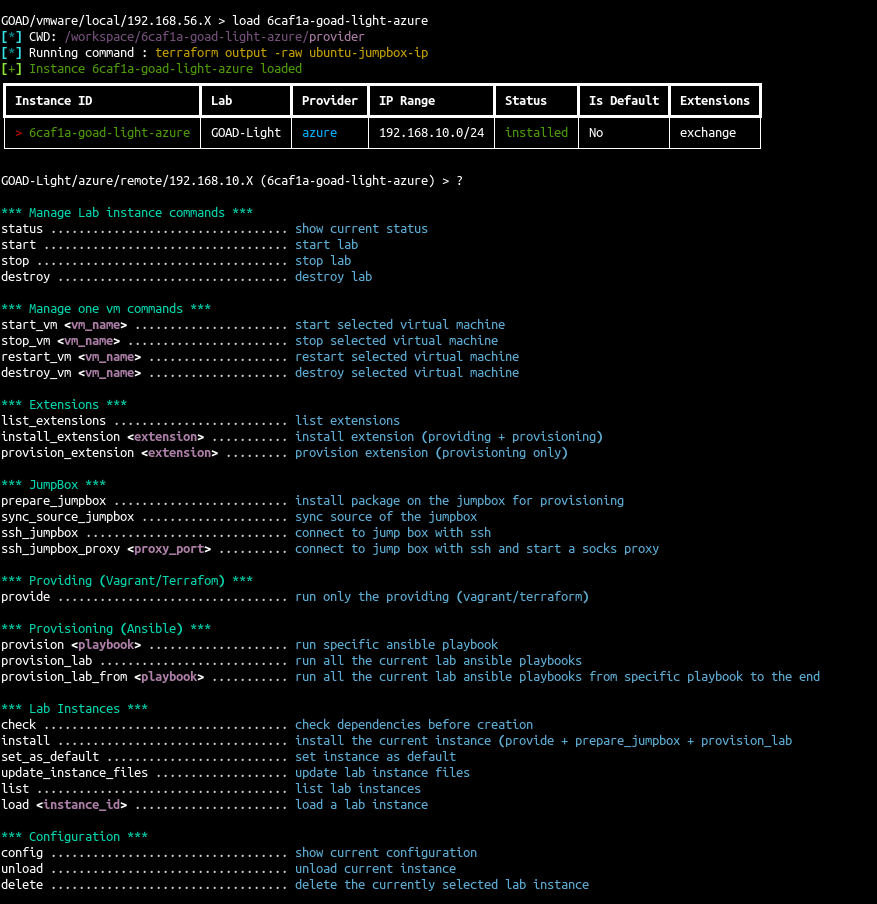

# :material-console-line: GOAD interactive mode

🚧 TODO complete me

Launch goad interactive mode



## Enter interactive mode

To enter interactive mode just launch goad without the `-t` parameter

``` bash
./goad.sh
```

## No lab instance selected

```
*** Lab Instances ***
check ................................... check dependencies before creation
install / create ........................ install the selected lab and create a lab instance
create_empty ............................ prepare a lab instance folder without providing and provisioning
list .................................... list lab instances
load <instance_id> ...................... load a lab instance

*** Configuration ***
config .................................. show current configuration
labs .................................... show all labs and available providers
set_lab <lab> ........................... set the lab to use
set_provider <provider> ................. set the provider to use
set_provisioning_method <method> ........ set the provisioning method
set_ip_range <range> .................... set the 3 first digit of the ip to use (ex: 192.168.56)
```

### check
### install
### create_empty
### list
### load

Select an instance by his name

> alias : `use`

```
load <instance name>
```

### config
### labs
### set_lab
### set_provider
### set_provisioning_method
### set_ip_range


## Instance selected



```
*** Manage Lab instance commands ***
status .................................. show current status
start ................................... start lab
stop .................................... stop lab
destroy ................................. destroy lab

*** Manage one vm commands ***
start_vm <vm_name> ...................... start selected virtual machine
stop_vm <vm_name> ....................... stop selected virtual machine
restart_vm <vm_name> .................... restart selected virtual machine
destroy_vm <vm_name> .................... destroy selected virtual machine

*** Extensions ***
list_extensions ......................... list extensions
install_extension <extension> ........... install extension (providing + provisioning)
provision_extension <extension> ......... provision extension (provisioning only)

*** JumpBox ***
prepare_jumpbox ......................... install package on the jumpbox for provisioning
sync_source_jumpbox ..................... sync source of the jumpbox
ssh_jumpbox ............................. connect to jump box with ssh
ssh_jumpbox_proxy <proxy_port> .......... connect to jump box with ssh and start a socks proxy

*** Providing (Vagrant/Terrafom) ***
provide ................................. run only the providing (vagrant/terraform)

*** Provisioning (Ansible) ***
provision <playbook> .................... run specific ansible playbook
provision_lab ........................... run all the current lab ansible playbooks
provision_lab_from <playbook> ........... run all the current lab ansible playbooks from specific playbook to the end

*** Lab Instances ***
check ................................... check dependencies before creation
install ................................. install the current instance (provide + prepare_jumpbox + provision_lab
set_as_default .......................... set instance as default
update_instance_files ................... update lab instance files
list .................................... list lab instances
load <instance_id> ...................... load a lab instance

*** Configuration ***
config .................................. show current configuration
unload .................................. unload current instance
delete .................................. delete the currently selected lab instance
```

### status

### start

### stop

### destroy

### start_vm

### stop_vm

### restart_vm

### destroy_vm

